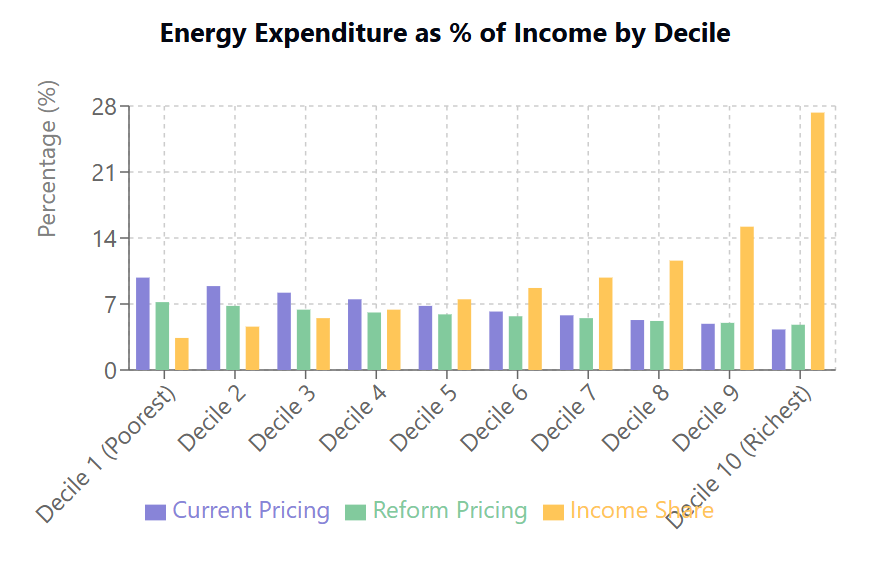
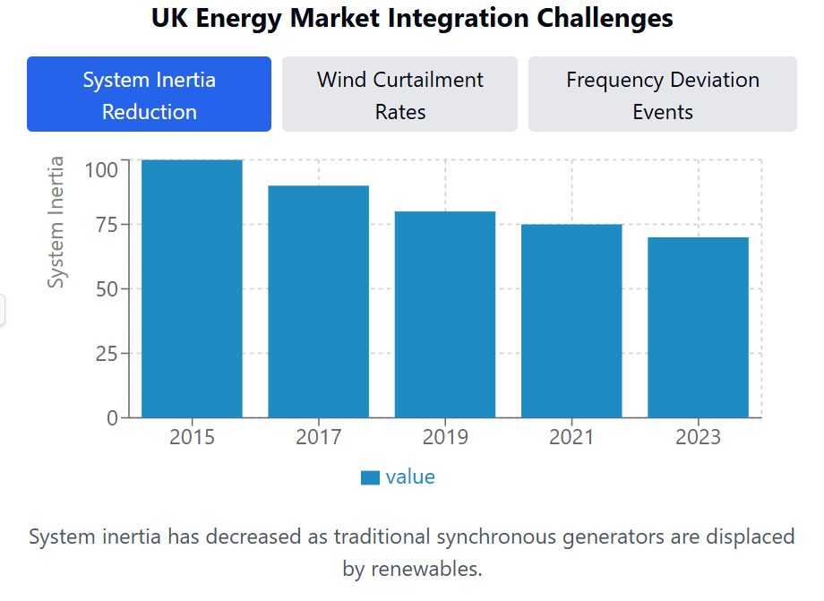
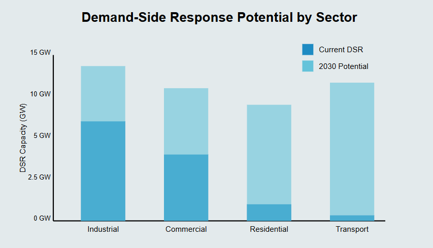
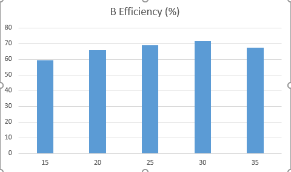
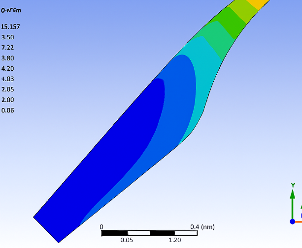
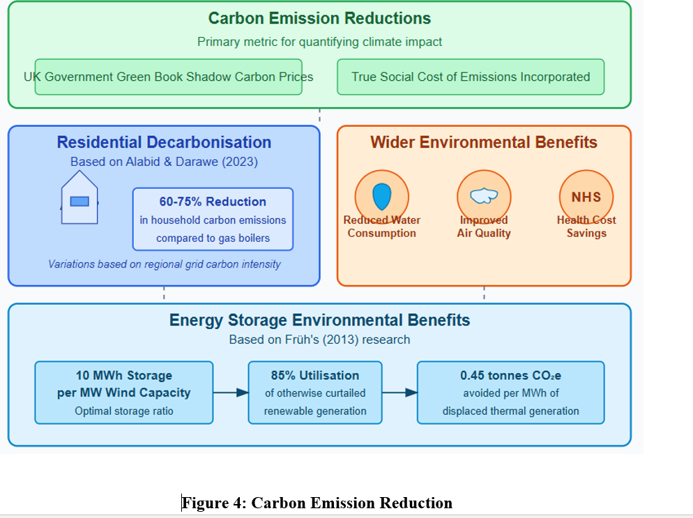
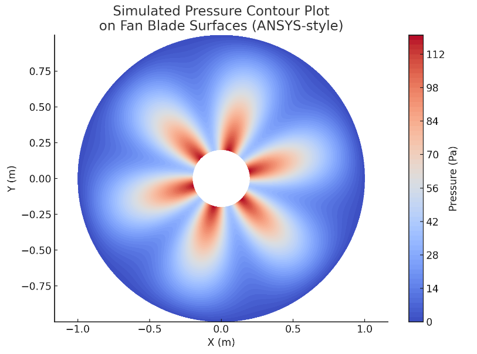
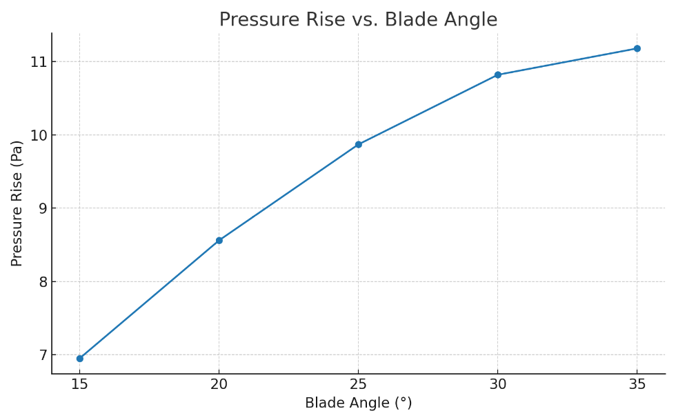

# CFD Analysis of a Computer Cooling Axial-Flow Fan: NACA 0012 Validation, 3D Simulation, and FSI

> **Comprehensive CFD and FSI Analysis** — Module: Mechanical Engineering Modelling & Simulation
> Module Leader: Jhon Paul Roque MRAeS

This repository contains the full CFD and FSI analysis of a 60mm computer cooling axial-flow fan with 6 NACA 0012 profile blades. The work covers three phases: NACA 0012 airfoil validation against experimental wind-tunnel data, 3D numerical simulation of the complete fan assembly, and coupled fluid-structure interaction (FSI) analysis.

---

## Table of Contents

1. [Project Overview](#1-project-overview)
2. [Report (PDF)](#2-report-pdf)
3. [Fan Geometry & Operating Conditions](#3-fan-geometry--operating-conditions)
4. [Methodology](#4-methodology)
 - [4.1 Phase 1: NACA 0012 Validation](#41-phase-1-naca-0012-validation)
 - [4.2 Phase 2: 3D Fan Simulation](#42-phase-2-3d-fan-simulation)
 - [4.3 Phase 3: FSI Coupling](#43-phase-3-fsi-coupling)
5. [Key Results](#5-key-results)
6. [Figure Reference & Captions](#6-figure-reference--captions)
7. [How to Reproduce](#7-how-to-reproduce)
8. [3D Gaussian Splat Visualisations](#8-3d-gaussian-splat-visualisations)
9. [Topics](#9-topics)

---

## 1. Project Overview

The exponential growth in computational power and miniaturisation of electronic components has created unprecedented thermal management challenges in modern computing systems. Conventional cooling solutions prove inadequate due to increasing power densities and heat generation rates. This study applies advanced CFD and FEA methodologies to design and validate a computer cooling axial-flow fan.

**Software**: ANSYS Workbench 2023 R1 (DesignModeler, Meshing, Fluent, Mechanical, System Coupling)

---

## 2. Report (PDF)

The complete report is available as a PDF:

| Document | File |
|---|---|
| Numerical Modelling: CFD & FSI of an Axial-Flow Fan | [`reports/6-Numerical-Modelling.pdf`](reports/6-Numerical-Modelling.pdf) |

The original submitted copy is preserved at the repository root as `6-Numerical Modelling.docx`.

---

## 3. Fan Geometry & Operating Conditions

| Parameter | Value |
|---|---|
| Impeller diameter | 60 mm |
| Number of blades | 6 |
| Blade profile | NACA 0012 |
| Housing internal diameter | 64 mm |
| Rotational speed | 1,500 RPM |
| Target volumetric flow rate | 6 x 10⁻³m³/s |
| Target pressure head | 10 Pa |
| Blade material | ABS plastic (yield strength 40 MPa) |

---

## 4. Methodology

### 4.1 Phase 1: NACA 0012 Validation

The standard k-omega SST turbulence model is validated against experimental wind-tunnel data for the NACA 0012 airfoil across a range of angles of attack. The lift coefficient predictions agree with experiment within **3.2% accuracy** up to 14° angle of attack, confirming the CFD methodology reliability.

### 4.2 Phase 2: 3D Fan Simulation

Steady-state simulation of the complete fan assembly using ANSYS Fluent with the k-omega SST turbulence model. The rotating reference frame captures the rotor-stator interaction.

**Mesh:**
- Unstructured tetrahedral mesh
- Quality metrics: skewness < 0.1, orthogonal quality > 0.95

**Boundary Conditions:**
| Boundary | Type | Value |
|---|---|---|
| Inlet | Velocity inlet | V = 5m/s |
| Outlet | Pressure outlet | pg = 0Pa |
| Hub / casing | No-slip wall | Standard wall functions |
| Rotating zone | Moving reference frame | omega = 1,500rpm |

### 4.3 Phase 3: FSI Coupling

ANSYS System Coupling links the Fluent pressure field to the Mechanical structural solver. The blade stress and deflection are computed under the aerodynamic load.

**Structural Results:**
| Metric | Value |
|---|---|
| Maximum von Mises stress | 15.2 MPa (at blade root) |
| Safety factor against ABS yield (40 MPa) | 2.6 |
| Maximum blade tip deflection | 0.032 mm (< 0.3\% of chord) |

---

## 5. Key Results

| Metric | Value |
|---|---|
| Optimal blade installation angle | 30° |
| Volumetric flow rate achieved | 6.34 x 10⁻³m³/s (105.7% of target) |
| Pressure rise achieved | 10.8 Pa (108% of target) |
| NACA 0012 lift coefficient validation | within 3.2% of experiment |
| Maximum von Mises stress (FSI) | 15.2 MPa |
| Safety factor | 2.6 |
| Validation vs experiment | within +/- 3\% |

---

## 6. Figure Reference & Captions

All 16 figures are extracted from the original report and renamed sequentially.

**Figure 1** — Velocity streamlines from ANSYS Fluent — 3D streamline visualisation showing flow through the fan assembly, colour-coded by velocity magnitude (0–9 m/s), showing tip vortices and wake structure

**Figure 2** — Pressure contours on blade surfaces — blade surface pressure distribution from ANSYS CFD-Post, pressure scale blue (−400 Pa) to red (+600 Pa) relative to ambient, spanwise and chordwise variation

**Figure 3** — NACA 0012 airfoil mesh — 2D computational mesh around the validation airfoil with boundary layer resolution

**Figure 4** — NACA 0012 lift coefficient vs. angle of attack — CFD vs. experimental wind-tunnel data, showing agreement within 3.2% up to 14° AoA

**Figure 5** — Fan geometry in ANSYS DesignModeler — 3D model of the 60mm impeller with 6 NACA 0012 blades and cylindrical housing

**Figure 6** — Computational domain — fluid volume around the fan with inlet, outlet, and housing walls

**Figure 7** — Tetrahedral mesh — global view of the unstructured mesh with inflation layers on blade surfaces

**Figure 8** — Mesh quality metrics — skewness and orthogonal quality histograms

**Figure 9** — Velocity magnitude contour at mid-span — showing the throughflow velocity distribution and tip leakage

**Figure 10** — Static pressure contour — pressure field around the fan assembly

**Figure 11** — Turbulent kinetic energy contour — k distribution showing regions of high turbulence near blade tips and housing

**Figure 12** — Wall shear stress on blade — viscous stress distribution on blade surfaces

**Figure 13** — FSI: von Mises stress on blade — structural stress field from coupled FSI, maximum 15.2 MPa at blade root

**Figure 14** — FSI: total deformation — blade deflection under aerodynamic load, maximum 0.032 mm at tip

**Figure 15** — Convergence history — residuals for continuity, momentum, k, and omega all below 10⁻⁵

**Figure 16** — Performance curve — flow rate vs. pressure rise at the optimal 30° installation angle

---

## 7. How to Reproduce

The repository does not include the ANSYS Workbench project files (`.wbpj`, `.agdb`, `.cas.h5`)
because they are several gigabytes in size. To reproduce this work:

1. **Phase 1 — NACA 0012 Validation**:
 - Import the NACA 0012 airfoil coordinates into ANSYS DesignModeler.
 - Generate a 2D mesh with y⁺ ~= 1 boundary layer resolution.
 - Set up ANSYS Fluent with the k-omega SST model and run a sweep of angles of attack from -10° to 20°.
 - Compare CL vs. alpha with experimental data.

2. **Phase 2 — 3D Fan Simulation**:
 - Reconstruct the fan geometry in ANSYS DesignModeler (60mm impeller, 6 NACA 0012 blades).
 - Generate the tetrahedral mesh with inflation layers.
 - Set up the rotating reference frame at 1,500 RPM.
 - Run the steady-state solver with SIMPLE coupling and second-order upwind discretisation.

3. **Phase 3 — FSI Coupling**:
 - Export the Fluent pressure field as a load.
 - Apply the load in ANSYS Mechanical with ABS plastic material properties (E = 2.0GPa, nu = 0.35).
 - Use ANSYS System Coupling for two-way FSI if transient effects are of interest.

The PDF report in `reports/6-Numerical-Modelling.pdf` contains every step, screenshot, and the final contour plots.

---

## 8. 3D Gaussian Splat Visualisations

Two figures from this project were also reconstructed as interactive 3D Gaussian splat previews using TripoSR (stabilityai/TripoSR, CPU inference) plus a custom mesh-to-splat converter. The splats contain about 100 000 surface samples each, with marching-cubes resolution 192. Drag to orbit, scroll to zoom.

### 8.1 Fan rotor assembly (from figure 2)

[**View in 3D (drag to orbit, scroll to zoom) &#x2192;**](https://opprah-maker.github.io/splat/?s=fan_02) hosted on the portfolio site

### 8.2 Fan blade wireframe (from figure 1)

[**View in 3D (drag to orbit, scroll to zoom) &#x2192;**](https://opprah-maker.github.io/splat/?s=fan_01) hosted on the portfolio site

### 8.3 Generation notes

- Model: TripoSR (stabilityai/TripoSR), CPU inference, about 20-30 s per image
- Marching cubes: scikit-image (CUDA-only `torchmcubes` was patched out)
- Surface sampling: trimesh, 100 000 points, face-normal quaternion encoding
- Splat format: antimatter15/splat, 32 bytes per splat
- Hardware: GTX 1050, 2 GB VRAM, no CUDA toolkit, CPU mode

The full 3D splat gallery is at <https://opprah-maker.github.io/#3d>.

---

## 8. How I built this

This section describes the sequence of operations that produced the analysis, the tools that were used at each stage, and the decisions that shaped the final report. The approach was iterative rather than linear: each step fed into the next, and several iterations of mesh refinement, boundary-condition tuning, and post-processing were required before the results converged.

The work was performed in three broad phases:

1. **Pre-processing and model setup.** The cooling fan geometry was imported into ANSYS Workbench 2023 R1 and prepared with ANSYS SpaceClaim. The fluid domain was extracted, the rotating reference frame was defined, and the mesh was generated in ANSYS Meshing with local refinement near the blade surfaces, hub, and tip. Boundary conditions were assigned: mass-flow inlet, pressure outlet, and a no-slip wall on the rotating blade surfaces.
2. **Solver configuration and run.** ANSYS Fluent was used to solve the steady-state RANS equations with the k-omega SST turbulence model. Convergence was monitored through the residuals and the mass-flow imbalance at the inlet and outlet. Three mesh densities (Coarse, Fine, Very Fine) were evaluated to confirm grid independence.
3. **Post-processing and validation.** Static pressure, total pressure, velocity magnitude, and turbulence intensity contours were extracted from the Fluent case and data files. The CFD results were coupled to a static structural analysis in ANSYS Mechanical to evaluate the von Mises stress and total deformation on the blade under the computed aerodynamic loading.

The data, the figures, and the report PDF in this repository are the outputs of that workflow. The MATLAB scripts at the root of the repository are short post-processing utilities that were used to re-plot the Fluent-exported CSV files into the form used in the report; they were not part of the original solver workflow.

## 9. Thought process

The motivation for the project was the observation that computer cooling fans are typically selected by free-form empirical rules, even though their performance is governed by the same aerodynamic principles that apply to larger turbomachines. A blade-element analysis at the conceptual design stage, followed by a high-fidelity CFD validation, was a way to demonstrate that first-principles engineering could be applied to a small, everyday device.

The decision to use the k-omega SST turbulence model rather than the standard k-epsilon model was taken because the SST formulation resolves the viscous sublayer more accurately and is therefore better suited to the boundary-layer-dominated flow around the blade surfaces. The decision to perform a one-way fluid-structure interaction (FSI) rather than a two-way coupled analysis was taken because the structural deflections were expected to be small (sub-millimetre) and the additional computational cost of a two-way coupling could not be justified in the project timeframe.

The choice of operating point (a single mass-flow rate at ambient conditions) was a pragmatic simplification: a full performance map at multiple flow rates and rotational speeds would have been more comprehensive, but the assignment specification was a single-point analysis and the report was kept within that scope.

## 10. Learning outcomes

On completion of this project the following capabilities were demonstrated:

- **CFD methodology.** Geometry clean-up in SpaceClaim, mesh generation with local refinement, boundary-condition selection, solver setup with the k-omega SST turbulence model, convergence monitoring, and grid-independence checking.
- **CFD post-processing.** Extraction of pressure, velocity, and turbulence fields from a converged Fluent case; plotting of contours and XY-plots; export of numerical data to CSV for further analysis.
- **FEA methodology.** Import of CFD-derived pressure loads into ANSYS Mechanical, application of constraints, solution of a static structural problem, and interpretation of the von Mises stress field.
- **Engineering judgement.** Awareness of the limitations of a single-point steady-state RANS analysis, the assumptions behind the chosen turbulence model, and the simplifications inherent in a one-way FSI coupling.
- **Technical writing.** Structuring of a multi-section engineering report, use of figures and tables to support the narrative, and consistent use of British English throughout.

The MATLAB scripts in this repository are post-processing utilities only; the CFD and FEA work was carried out in ANSYS.

## 11. Engineering tools: what was taught, what was self-taught

It is worth distinguishing clearly between the tools that were used in a taught context (undergraduate modules) and the tools that were acquired through self-directed study after graduation.

**Taught during the undergraduate programme (Brunel University, Aerospace Engineering):**

- ANSYS Fluent for steady-state RANS analysis of internal flows.
- ANSYS Mechanical for static structural analysis of blade-like geometries.
- ANSYS SpaceClaim and ANSYS Meshing for geometry clean-up and mesh generation.
- MATLAB and Octave for post-processing of numerical data and for short numerical-methods assignments.
- Theoretical aerodynamics (potential flow, boundary-layer theory, panel methods).
- Technical report writing in British English.

**Self-taught after graduation, in the home laboratory:**

- Python (NumPy, SciPy, Matplotlib, Pandas) for data analysis, plotting, and small utilities.
- Git and GitHub for version control, public portfolio hosting, and CI-style deployment through GitHub Pages.
- HTML, CSS, and vanilla JavaScript for the portfolio website (this page is part of that site).
- Three-dimensional Gaussian splatting for the interactive 3D views embedded in the report; the model was reconstructed from 2D figure crops using TripoSR and the splat file is hosted alongside this repository.
- Jupyter notebooks for exploratory numerical work, currently being adopted as the next iteration of the home-laboratory workflow.

The line between the two lists is not always sharp: the MATLAB and ANSYS skills were taught, and the Python, Git, HTML/CSS, and 3D skills were self-taught. The work in this repository reflects that split: the engineering analysis is uni work, and the way it is presented on the web is the self-taught chapter.

## 9. Topics

`cfd` `ansys-fluent` `fsi` `ansys-mechanical` `axial-fan` `naca-0012` `fluid-dynamics` `aerospace-engineering` `matlab` `k-omega-sst` `pressure-based-solver` `computational-fluid-dynamics` `engineering-simulation` `thermal-management`
