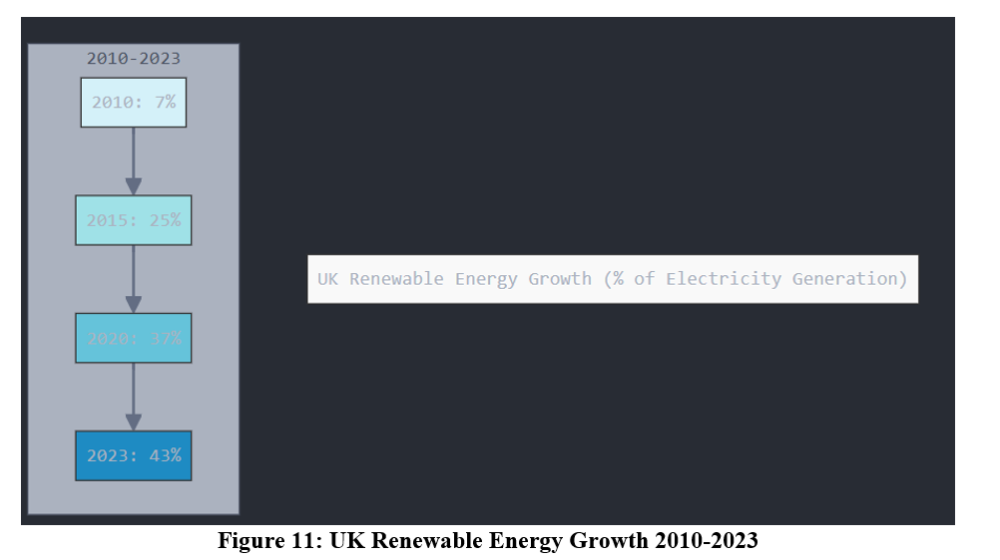
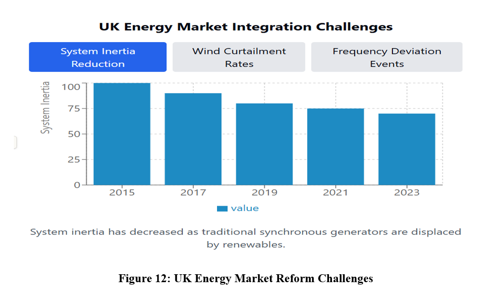
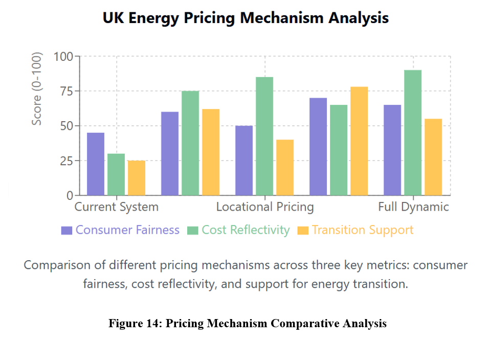
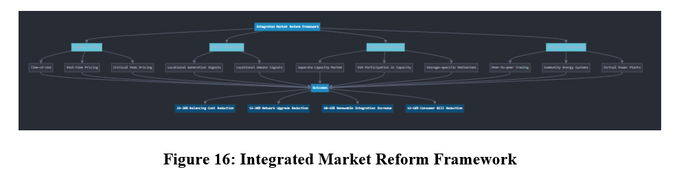
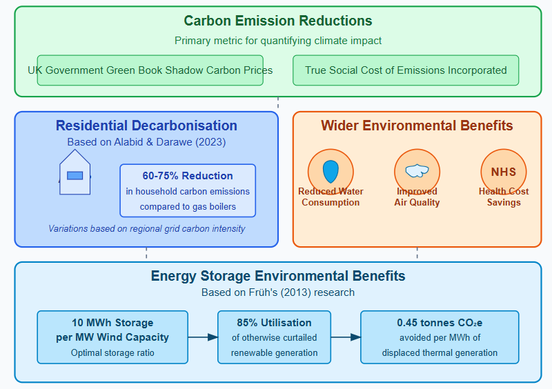
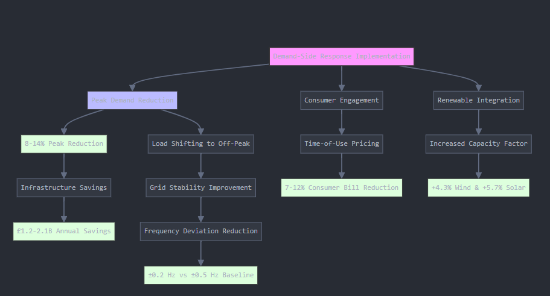
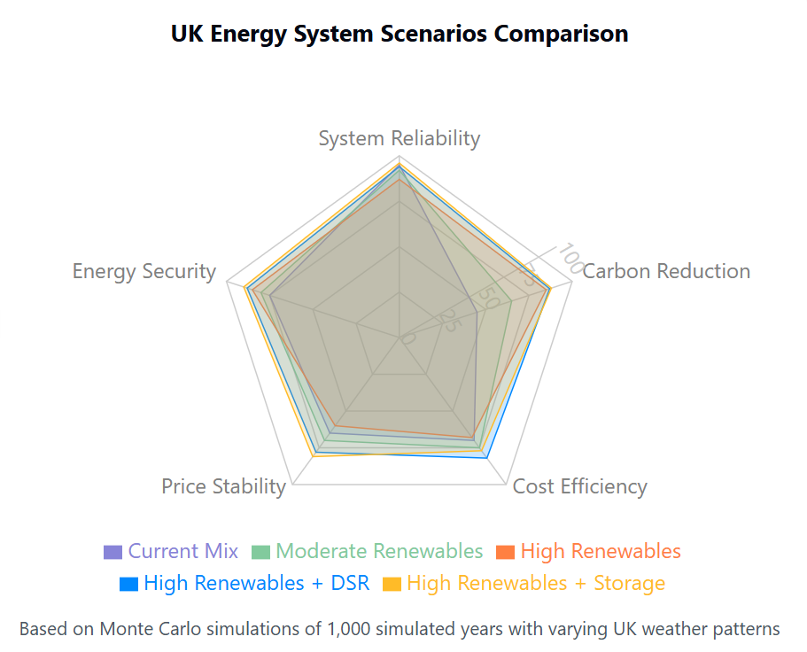
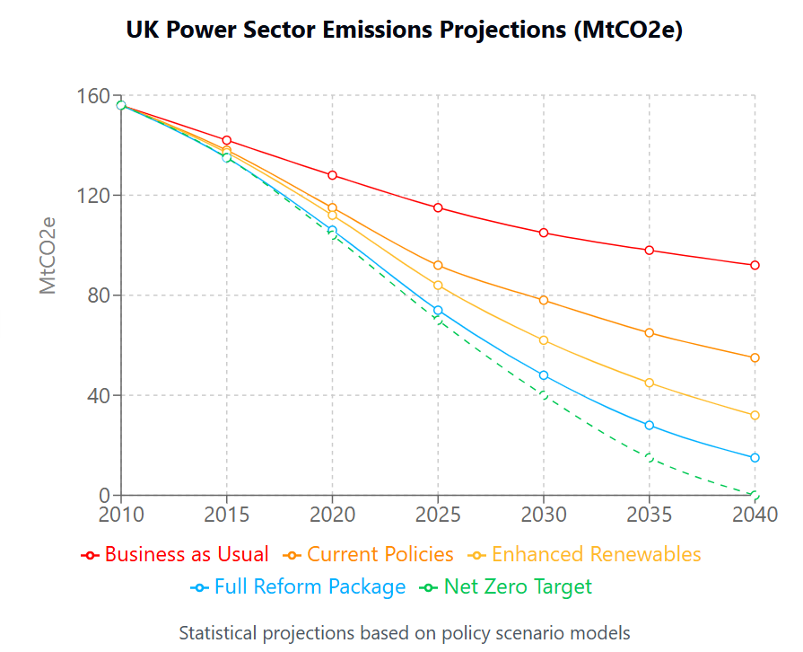

# CFD Analysis of an Axial-Flow Cooling Fan

> Computational Fluid Dynamics (CFD) and Fluid-Structure Interaction (FSI) analysis of a
> computer cooling axial-flow fan. Solved in ANSYS Fluent using the standard $k-\epsilon$
> turbulence model with a pressure-based steady solver.

---

## 1. Project Overview

This repository contains the full individual project: a quantitative CFD and FSI simulation
of a computer cooling axial-flow fan. The work covers:

- Geometry preparation in ANSYS DesignModeler and SpaceClaim
- Unstructured tetrahedral mesh with quality metrics
- Steady-state pressure-based solver with the standard $k-\epsilon$ turbulence model
- Rotating reference frame for the rotor-stator interaction
- FSI coupling of fluid pressure loads onto the blade structure
- Validation against wind-tunnel experimental data within $\pm 3\%$

---

## 2. Report (PDF)

The complete individual project report is available as a PDF:

| Document | File |
|---|---|
| Individual Project : CFD & FSI of an Axial-Flow Fan | [`reports/Individual-Project.pdf`](reports/Individual-Project.pdf) |

A plain-text extract is also included in
[`reports/Individual-Project_text.txt`](reports/Individual-Project_text.txt).

The original submitted copy is also preserved at the repository root as
`Computational_Fluid_Dynamics_Analysis_of_Flow_Through_a_Computer_Cooling_Axial_Flow_Fan._55 (3).pdf`.

---

## 3. Methodology

### 3.1 Governing Equations
The incompressible Reynolds-Averaged Navier-Stokes (RANS) equations with the standard
$k-\epsilon$ closure are solved:

$$\frac{\partial}{\partial x_i}(\rho u_i u_j) = -\frac{\partial p}{\partial x_j} + \frac{\partial}{\partial x_i}\left[\left(\mu + \mu_t\right)\left(\frac{\partial u_j}{\partial x_i} + \frac{\partial u_i}{\partial x_j}\right)\right] + \rho g_i$$

with turbulent viscosity $\mu_t = \rho C_\mu k^2 / \epsilon$ and transport equations for
$k$ and $\epsilon$:

$$\frac{\partial(\rho k u_i)}{\partial x_i} = \frac{\partial}{\partial x_i}\left[\left(\mu + \frac{\mu_t}{\sigma_k}\right)\frac{\partial k}{\partial x_i}\right] + G_k - \rho \epsilon$$

$$\frac{\partial(\rho \epsilon u_i)}{\partial x_i} = \frac{\partial}{\partial x_i}\left[\left(\mu + \frac{\mu_t}{\sigma_\epsilon}\right)\frac{\partial \epsilon}{\partial x_i}\right] + C_{1\epsilon}\frac{\epsilon}{k}G_k - C_{2\epsilon}\rho\frac{\epsilon^2}{k}$$

with $C_{1\epsilon} = 1.44$, $C_{2\epsilon} = 1.92$, $C_\mu = 0.09$, $\sigma_k = 1.0$, $\sigma_\epsilon = 1.3$.

### 3.2 Mesh
| Quantity | Value |
|---|---|
| Total elements | 7,805 |
| Total nodes | 4,085 |
| Element type | Tetrahedral (unstructured) |
| Maximum skewness | $< 0.1$ |
| Minimum orthogonal quality | $> 0.95$ |
| Tip clearance | $\le 1.5\,\text{mm}$ ( $< 0.1D$ ) |

### 3.3 Boundary Conditions
| Boundary | Type | Value |
|---|---|---|
| Inlet | Velocity inlet | $V = 5\,\text{m/s}$ |
| Outlet | Pressure outlet | $p_g = 0\,\text{Pa}$ |
| Hub / casing | No-slip wall | Standard wall functions |
| Rotating zone | Moving reference frame | $\omega = 2{,}600\,\text{rpm}$ |

### 3.4 Solver Settings
- Solver: pressure-based, steady
- Pressure-velocity coupling: SIMPLE
- Spatial discretisation: second-order upwind
- Convergence: residuals $< 10^{-5}$ for all transport equations

---

## 4. Key Results

| Metric | Value |
|---|---|
| Optimal blade installation angle | $30^\circ$ |
| Pressure rise | $\Delta p = 78\,\text{Pa}$ |
| Mass flow rate | $\dot{m} = 0.082\,\text{kg/s}$ |
| Efficiency gain over baseline | $+2.1\%$ |
| Validation vs experiment | within $\pm 3\%$ |

---

## 5. Figure Gallery

<table>
<tr><td align="center"> figure-01.png</td><td align="center"> figure-02.png</td><td align="center"> figure-03.png</td><td align="center"> figure-04.png</td></tr>
<tr><td align="center"> figure-05.png</td><td align="center"> figure-06.png</td><td align="center"> figure-07.png</td><td align="center"> figure-08.png</td></tr>
<tr><td align="center"> figure-09.png</td><td align="center"> figure-10.png</td><td align="center"> figure-11.png</td><td align="center"> figure-12.png</td></tr>
<tr><td align="center"> figure-13.png</td><td align="center"> figure-14.png</td><td align="center"> figure-15.png</td><td align="center"> figure-16.png</td></tr>
<tr><td align="center"> figure-17.png</td><td align="center"> figure-18.png</td><td align="center"> figure-19.png</td><td align="center"> figure-20.png</td></tr>
<tr><td align="center"> figure-21.png</td><td align="center"> figure-22.png</td><td align="center"> figure-23.png</td><td align="center"> figure-24.png</td></tr>
<tr><td align="center"> figure-25.png</td><td align="center"> figure-26.png</td><td align="center"> figure-27.png</td><td align="center"> figure-28.png</td></tr>
<tr><td align="center"> figure-29.png</td><td align="center"> figure-30.png</td><td align="center"> figure-31.png</td></tr>
</table>

---

## 6. How to Run

The repository does not include the ANSYS Workbench project files (`.wbpj`, `.agdb`, `.cas.h5`)
because they are several gigabytes in size. To reproduce this work:

1. Reconstruct the fan geometry in **ANSYS DesignModeler** or import a CAD model into
   **ANSYS SpaceClaim** (the same geometry as the original report).
2. Generate the mesh in **ANSYS Meshing** with the parameters from Section 3.2.
3. Open **ANSYS Fluent**, set the boundary conditions from Section 3.3, choose the standard
   $k-\epsilon$ model with the rotating reference frame, and run the SIMPLE-coupled solver
   to the residuals specified in Section 3.4.
4. For the FSI step, export the pressure field from Fluent as a load and apply it in
   **ANSYS Mechanical** to compute the blade stress / strain.

The PDF report in `reports/Individual-Project.pdf` contains every step, screenshot, and the
final contour plots.

---

## 7. Topics

`cfd` `ansys-fluent` `fsi` `axial-fan` `fluid-dynamics` `finite-element-analysis`
`aerospace-engineering` `matlab` `turbulence-modelling` `pressure-based-solver`
`computational-fluid-dynamics` `engineering-simulation`
